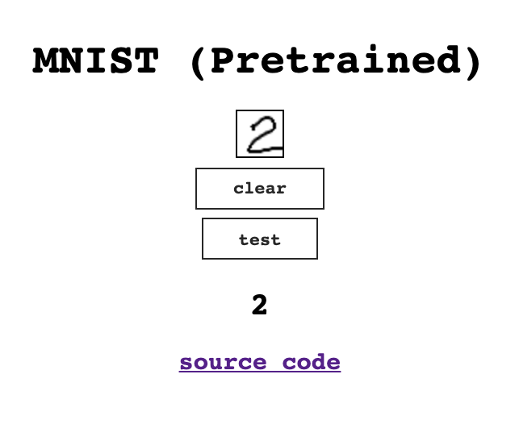

# mnist
MNIST Training + Website

This repo incudes the python code to train a neural network to recognise the famous mnist data set and how to export, import and use it inside a [website](https://mnist.nicco.io) after training.

  

